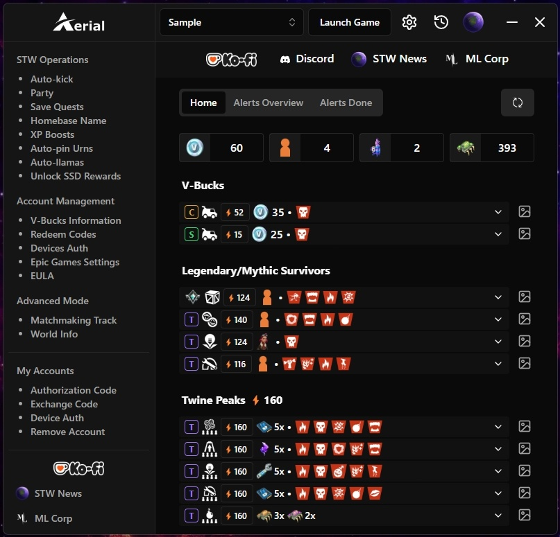

> **NOTE:** Currently in development.

 

    

> [!IMPORTANT]
>
> - None developer of this application is associated with Epic Games.
> - **_Since this project is Open-Source, be careful if you download the installer for a version from sources other than this repository, those other sources may have malicious code_**.

# Aerial Launcher

A Windows desktop application (based on Potato Launcher) to manage things on Fortnite STW.

  

## Development Motivation (Lore)

Most STW players can agree that most of us reach a point where we start using alts to progress even more in the game. Training, doing vbucks on alts, preparing missions... And we end up using discord bots to make our life's easier, leaving missions earlier, and claiming chests on loading screens. The main purpose of the launcher is to have all this features in the same place, storing all the information locally. Have to give some credits to Fresh and Kuda for giving me ideas and their opinion during the development, and then obviously credits to me (Ciensprog) as I'm developing the entirety of Aerial alone.

I must clarify that I am a hispanic player and given how large many communities can be, I have realised that there are many projects but few are developed by hispanic players and that's kinda lame.

There are Discord bots that can facilitate many things, for utilities and account administration and that is cool, I was very interested in the idea of creating something similar and sharing with my friends. There was already an open source application (Potato Launcher) to manage STW accounts, but as everyone can agree now, its really outdated. My main idea when I started developing Aerial was to remake a new Potato-Launcher but with all the new implementations that we've had along the years, such as kalp, ca, autokick, hl, bulk operations... And all the premium features that discord bot owners put behind a pay-wall.

As a Software Developer I felt motivated to develop an Open-Source project that serves the community and the grinders in a daily basis.

But what does it mean that this project is Open-Source? It is very simple, to ensure that no one thinks or defames the project as a virus, the hole source of every version of Aerial-Launcher will remain open to the public. Everyone can go and look through the source code and check if there's anything malicious in it.

## Table of Contents

- [Aerial Launcher](#aerial-launcher)
  - [Development Motivation (Lore)](#development-motivation-lore)
  - [Table of Contents](#table-of-contents)
  - [Installation](#installation)
    - [Good To Know](#good-to-know)
      - [Synchronize existing `accounts.json` from Potato Launcher](#synchronize-existing-accountsjson-from-potato-launcher)
      - [Update Application](#update-application)
  - [Features](#features)
    - [Settings](#settings)
      - [Epic Games Settings](#epic-games-settings)
      - [Custom Path](#custom-path)
      - [Custom Display Name](#custom-display-name)
    - [Accounts in Launcher](#accounts-in-launcher)
      - [Add Accounts](#add-accounts)
      - [Remove Accounts](#remove-accounts)
      - [Launch Game](#launch-game)
      - [Generate Exchange Code](#generate-exchange-code)
      - [STW News Profile](#stw-news-profile)
  - [🤝 Contributing](#-contributing)

## Installation

You can download the latest release (Aerial.Launcher-x.x.x.Setup.exe) from [releases](https://github.com/Ciensprog/Aerial-Launcher/releases) page.

### Good To Know

Since this application is not code signed, when you try to install you will see a blue (or another color/style) dialog modal to confirm if you want to proceed, it only happens the first time you install.

This folder is being using to save any settings `C:\Users\YOUR_USER\AppData\Roaming\aerial-launcher-data` inside this folder you can find an `accounts.json` file with all your accounts previously added.

#### Synchronize existing `accounts.json` from Potato Launcher

If you are using Potato Launcher you can use your existing `accounts.json` file with Aerial Launcher. You can synchronize doing this:

> Remember replace YOUR_USER text with your user.

1. Copy `accounts.json` file from `C:\Users\YOUR_USER\AppData\Roaming\a.bakedpotato\fnappv2` folder.
1. Go to `C:\Users\YOUR_USER\AppData\Roaming\aerial-launcher-data` folder and paste `accounts.json` file.
1. Restart launcher and your accounts should be loaded.

#### Update Application

When a new version is available, you will see a notification in the home section with a link to the project repository release page.

## Features

> Note: new features are still in development.

### Settings

#### Epic Games Settings

From the selected account, you will be redirected to your account settings on the Epic Games website.

#### Custom Path

By default, the directory `C:\Program Files\Epic Games\Fortnite\FortniteGame\Binaries\Win64` is used but it can be changed in settings.

#### Custom Display Name

Sometimes you could need a specific display name for identifying an account. If you want, you can change the current display name with a custom name.

> Note: this only applies visually to the launcher accounts.

### Accounts in Launcher

#### Add Accounts

You can add new accounts using any of these methods:

- Authorization Code.
- Device Auth.
- Exchange Code.

#### Remove Accounts

You can remove any account previously added.

#### Launch Game

If you want, you can launch game using "Launch Game" button, this open Fortnite Game using account selected.

#### Generate Exchange Code

Once the accounts have been added, you will be able to generate an Exchange Code for the selected account. From the same place to add account using the Exchange Code method.

#### STW News Profile

You can access the [STW News](https://stw.news/) profile of the selected account.

## 🤝 Contributing

1. [Fork this repository](https://github.com/Ciensprog/Aerial-Launcher/fork).
1. Clone your fork `git clone https://github.com/YOUR_USERNAME/Aerial-Launcher.git`
1. Create a new branch `git checkout -b new-feature`. Note: replace _new-feature_ text if you want.
1. When you are ready, stage changes with `git add .`
1. Commit your changes `git commit 'my new feature'`
1. Push your commit `git push origin new-feature`
1. [Submit a Pull Request](https://github.com/Ciensprog/Aerial-Launcher/pulls).

Alternatively, you can [create an issue](https://github.com/Ciensprog/Aerial-Launcher/issues/new) for reporting any bugs that you find.
